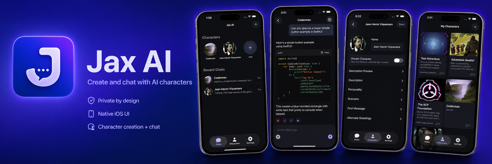

<p align="center">
  <a href="https://apps.apple.com/us/app/jaxai-private-local-chats/id6766075121">
    
  </a>
</p>
    
## JaxAI — Local‑First AI Chat for iOS

JaxAI is a native iOS app that gives you private, flexible AI chat on your iPhone. Connect to your own local KoboldCPP server for fully local inference on your network, or optionally use OpenRouter to access cloud models. No accounts. No analytics.

This repository contains the iOS app source. A separate Swift Package, SwiftLLMSDK, provides the AI/LLM API layer used by the app.

### Highlights
- **Local**: Connect to your own KoboldCPP API (LAN or self‑hosted remote).
- **Cloud option**: Use OpenRouter or OpenAI compatible services for powerful cloud-hosted models when you choose.
- **Deep character support**: Create/import character cards and Lore Books with rich personality and memory.
- **Advanced customization**: Control temperature, sampler options, max tokens, system prompts, and more.
- **Native iOS experience**: SwiftUI UI, with minor UIKit-hosted views when required.
- **Privacy‑first**: No ads, no tracking, no data collection.

---

## Requirements
- Xcode 26 or newer
- iOS 26.0+
- Swift 5

---

## Getting Started

### 1) Clone
```bash
git clone https://github.com/DevonJerothe/Jax-AI.git
```

If you plan to reference the SDK locally, point SPM at a local copy.
```bash
cd ..
git clone https://github.com/DevonJerothe/SwiftLLMSDK.git
```

### 2) Open and build
1. Open `PocketAI.xcodeproj` in Xcode.
2. Let Swift Package Manager resolve dependencies.
3. Select the `PocketAI` scheme and build/run on iOS 26+ device or simulator.

### 3) Configure a model backend
In‑app connection settings let you choose:
- **KoboldAPI (local/remote)**: Provide `host` and `port` of your KoboldCPP server.
- **OpenRouter (cloud)**: Provide an API key and select a model.
- **OpenAI Compatible API**: Allows for any OpenAI standard endpoints to be used.

Notes:
- When using a local KoboldCPP server on your LAN, prompts do not leave your network.
- When using OpenRouter or a remote KoboldCPP endpoint, prompts are sent to that provider per their terms.

---

## Privacy
- JaxAI collects no analytics or data and has no ads.
- With a local KoboldCPP or OpenAI compatible server on your network, prompts stay on your devices/network.
- Using OpenRouter or any remote endpoint sends prompts to that provider under their terms and policies.

---

## App Store Release
JaxAI is free on the App Store. Due to certain age restrictions and policies, some features may be omitted. Currently, this directly affects character browsers.
The following changes are planned for the App Store version:
- Removal of remote browsers (manual import only)

## Roadmap
- Model‑aware prompt templates and better reasoning instructions
- More granular streaming controls and retry/backoff policies
- Extensions support
- Guided card generation and edits
---

## Acknowledgements
- [KoboldCPP](https://github.com/koboldcpp/koboldcpp)
- [OpenRouter](https://openrouter.ai/)
- [GRDB.swift](https://github.com/groue/GRDB.swift)

---

## License
GPL (GNU GENERAL PUBLIC LICENSE)
