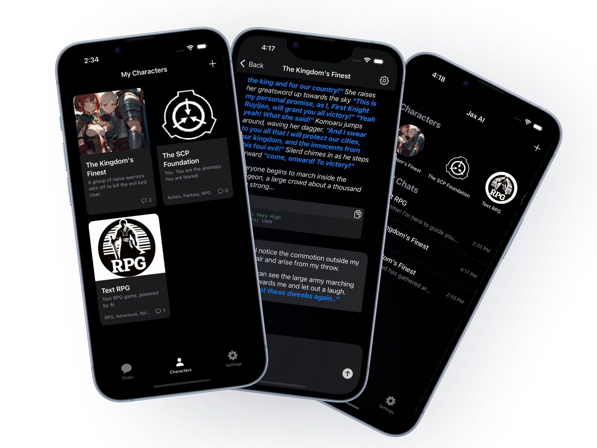

## JaxAI — Local‑First AI Chat for iOS

JaxAI is a native iOS app that gives you private, flexible AI chat on your iPhone. Connect to your own local KoboldCPP server for fully local inference on your network, or optionally use OpenRouter to access cloud models. No accounts. No analytics.

This repository contains the iOS app source. A separate Swift Package, SwiftLLMSDK, provides the AI/LLM API layer used by the app.

### Highlights
- **Local**: Connect to your own KoboldCPP API (LAN or self‑hosted remote).
- **Cloud option**: Use OpenRouter for powerful hosted models when you choose.
- **Deep character support**: Create/import character cards with rich personality and memory.
- **Advanced customization**: Control temperature, max tokens, system prompts, and more.
- **Native iOS experience**: SwiftUI UI, with minor UIKit hosted views when required.
- **Privacy‑first**: No ads, no tracking. With a local server, prompts stay on your network.

### Screenshots
<div>
  



</div>

---

## Requirements
- Xcode 16 or newer
- iOS 17.0+
- Swift 5

---

## Getting Started

### 1) Clone
```bash
git clone https://github.com/DevonJerothe/Jax-AI.git
```

If you plan to reference the SDK locally:
```bash
cd ..
git clone https://github.com/DevonJerothe/SwiftLLMSDK.git
```


Alternatively, you can point the package to the Git URL inside Xcode if you prefer a remote dependency.

### 2) Open and build
1. Open `PocketAI.xcodeproj` in Xcode.
2. Let Swift Package Manager resolve dependencies (including `SwiftLLMSDK`, MarkdownUI, Splash, GRDB, etc.).
3. Select the `PocketAI` scheme and build/run on iOS 17+ device or simulator.

### 3) Configure a model backend
In‑app connection settings let you choose:
- **KoboldAPI (local/remote)**: Provide `host` and `port` of your KoboldCPP server.
- **OpenRouter (cloud)**: Provide an API key and select a model.

Notes:
- When using a local KoboldCPP server on your LAN, prompts do not leave your network.
- When using OpenRouter or a remote KoboldCPP endpoint, prompts are sent to that provider per their terms.

---

## Architecture Overview

JaxAI cleanly separates the UI from the AI/LLM logic by delegating all model APIs to a dedicated Swift package.

- `SwiftLLMSDK` (Swift Package, separate repo)
  - Encapsulates all LLM integrations and API calls.
  - Provides strongly typed request builders and API managers for multiple backends (e.g., KoboldCPP via `KoboldAPI`, OpenRouter via `OpenRouterAPI`).
  - Streams and non‑stream responses, token counting, model listing, context length utilities.

- App layer
  - `PocketAI/Managers/ServiceContainer.swift`: Lightweight service locator for shared app services and persistent `ConnectionSettingsModel`. As well as high‑level state (isConnected, selected model, etc.) used by SwiftUI views.
  - `PocketAI/Managers/LanguageModelService.swift`: Owns the two API managers (`APIManager<KoboldAPI>` and `APIManager<OpenRouterAPI>`), switches behavior based on `connectionType`, and exposes:
    - `connect()` and `updateConnection()` lifecycle
    - `sendMessage(...)` and `sendStreamedMessage(...)` for chat
    - `getAvailableModels()` (OpenRouter) and `getMaxContextLength()` / `countTokens()` (Kobold)
    - Context management (e.g., ensuring app’s context length doesn’t exceed backend max)

## Privacy
- JaxAI collects no analytics and has no ads.
- With a local KoboldCPP server on your network, prompts stay on your devices/network.
- Using OpenRouter or any remote endpoint sends prompts to that provider under their terms and policies.

---

## Roadmap
- Additional character card formats and import tools - (Char archive has been shut down)
- Model‑aware prompt templates and better reasoning instructions
- More granular streaming controls and retry/backoff policies
- Better UI
---

## Acknowledgements
- [KoboldCPP](https://github.com/koboldcpp/koboldcpp)
- [OpenRouter](https://openrouter.ai/)
- [GRDB.swift](https://github.com/groue/GRDB.swift), [MarkdownUI](https://github.com/gonzalezreal/swift-markdown-ui), [Splash](https://github.com/JohnSundell/Splash)

---

## License
GPL (GNU GENERAL PUBLIC LICENSE)